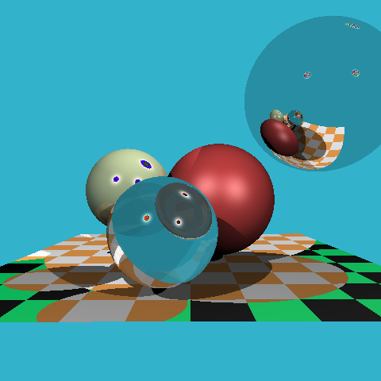

# Minimalis-tracer

This is mainly for self-reference.

## Preambule

This project has started as me trying to find a little insignificant yet cool project to be a little hands on with Haskell: I really liked the language but have seen that I spent most of my time (most of it on [leran you a haskell](http://learnyouahaskell.com/)) doing mostly reading and barely doing any coding. So, coming from a computer graphics/HPC background, I thought that coding some sort of minimalist ray tracer (like the one in [this amazing CG course by D.Sokolov](https://github.com/ssloy/tinyrenderer/wiki) ) would be a good idea. So I satrted by implementing it in Python! Very counter-intuitive, but I needed a prototype scene to compare my output to and the easiest way was to do it in Python (using only Numpy and PIL, so not so minimaist after all). However, the impelemntation was very slow (maybe I'll look into that someday!) so I  coded it in C (now using nothing! so we're going into the direction of minimalism but still no Haskell). Now that the impelemntation is pretty good and that I have a pretty good grasp of what I should do (took me long enough!), now onto Haskell!

**Main aim**: Use Haskell Multi-threading/GPU interfaces to accelearte the application.

## Scene

